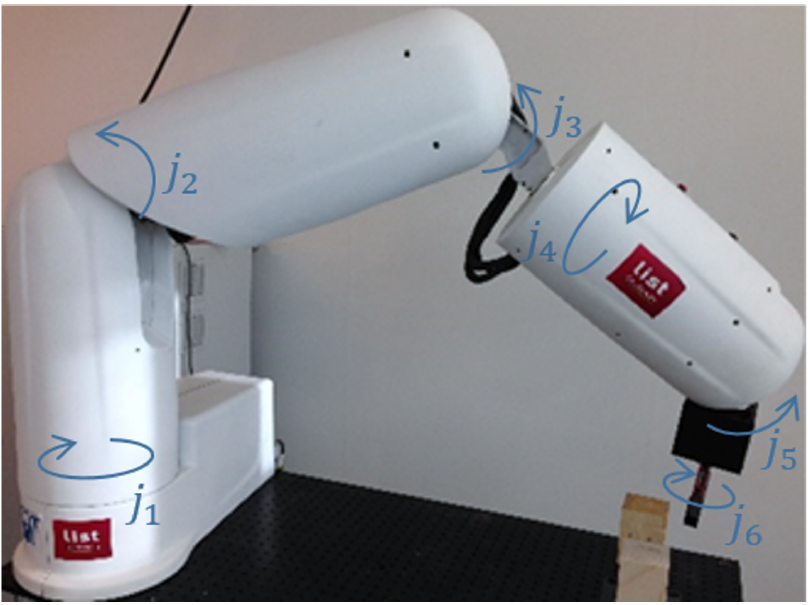
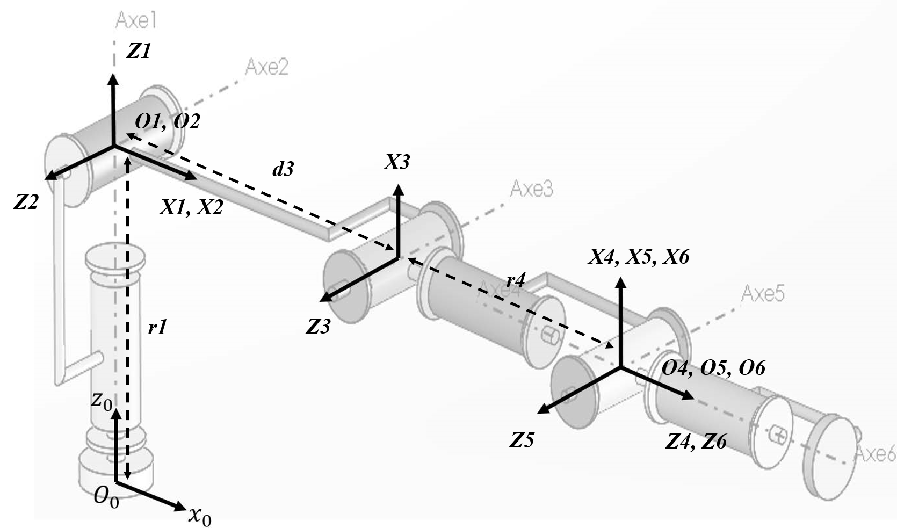
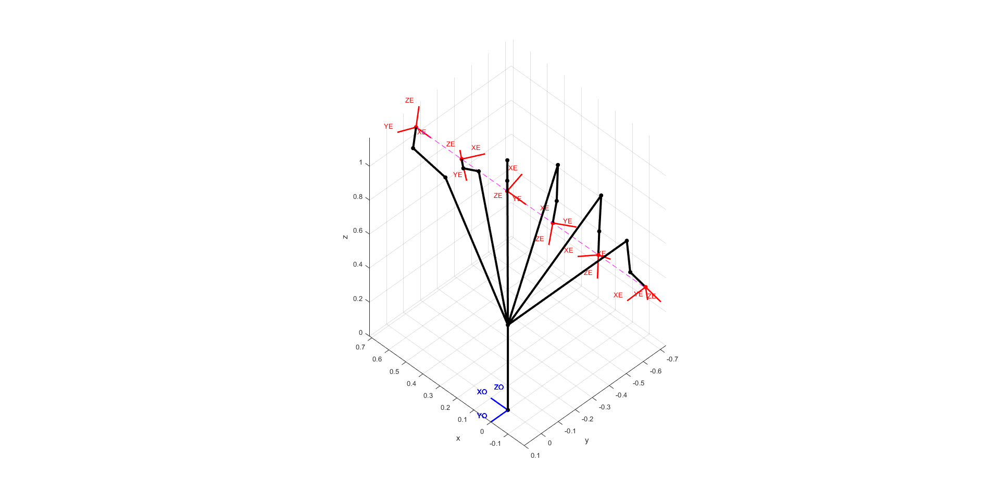
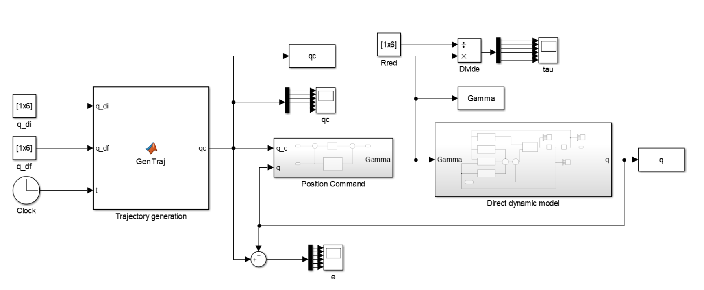

# Modeling and control of manipulator robots
*Author： Yan CHEN & Dajing GU*

*Prof : Mathieu GROSSARD* 

## Introducation

This is the course (ROB 315) project of ENSTA robotics. We propose to study the geometric and kinematic modeling of a manipulator arm developed by the Interactive Robotics Laboratory of the CEA List . This robot, which kinematic chain is of serial type, has 6 revolute joints.

 

This project has two parts.

* Direct and inverse kinematics

* Dynamics and control

